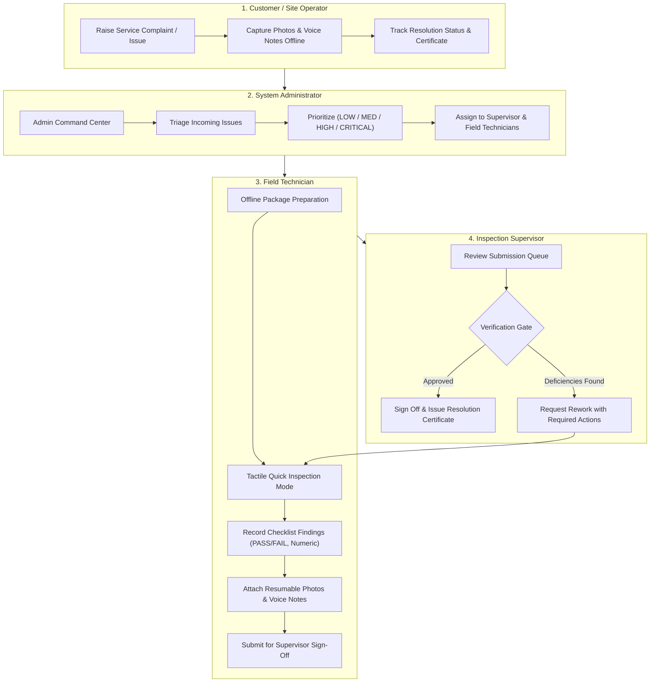
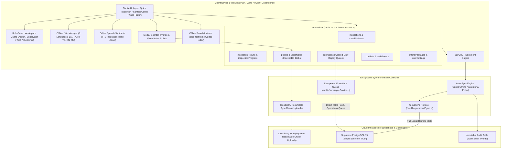

# FieldSync — Offline-First Collaborative Field Inspection PWA

[](https://www.typescriptlang.org/)
[](https://vitejs.dev/)
[](https://react.dev/)
[](https://dexie.org/)
[](https://yjs.dev/)
[](https://supabase.com/)
[](https://cloudinary.com/)
[-green.svg)](https://vitest.dev/)

> **FieldSync** is a production-grade, offline-first Progressive Web Application (PWA) built for industrial, utility, and infrastructure inspections in environments with zero connectivity. It features a complete **4-role enterprise lifecycle (Customer → Admin → Supervisor → Technician)**, real-time bi-directional Supabase PostgreSQL synchronization, Cloudinary resumable media uploads, Yjs CRDT conflict resolution, and immutable append-only audit histories.

---

## 🌐 Live Demonstration & Public Tunnel

FieldSync runs locally and is deployed globally via high-speed Cloudflare Edge Tunnels:

- **Cloudflare Edge Tunnel**: **[https://wife-assuming-seem-questionnaire.trycloudflare.com](https://wife-assuming-seem-questionnaire.trycloudflare.com)** *(Instant access, zero password prompt, full PWA offline support)*
- **GitHub Repository**: **[https://github.com/Tharun4743/FieldSync](https://github.com/Tharun4743/FieldSync)**

---

## 🎯 Problem Statement (WA-1) & Enterprise Scope

**WA-1. Offline-First Collaborative Field Inspection App**
- **Problem**: Technicians inspect critical industrial machinery, substations, and network facilities in locations with zero cellular coverage (basements, remote switchyards, subterranean conduits).
- **Core Requirement**: A PWA that functions 100% offline, converges multi-user edits using CRDTs without silent overwrites, exposes readable conflict adjudication and immutable audit logs, and handles resilient schema migrations and chunked media uploads.
- **Enterprise Expansion**: Beyond single-role inspection, FieldSync delivers a complete closed-loop lifecycle covering customer complaint logging, administrative triage and dispatch, supervisor verification and rework management, and technician field diagnostics.

---

## 👥 4-Role Enterprise Workflow

FieldSync organizes field inspection into four specialized, authenticated roles:



### Preconfigured Demonstration Credentials (Password: `123456`)
| Role | Name | Email | Primary Responsibilities |
|---|---|---|---|
| **ADMIN** | Tharun Erodde | `tharun@gmail.com` | Full system control, role assignment, ticket triage, audit inspection |
| **SUPERVISOR** | Abi Kumar | `abi@gmail.com` | Quality assurance, verification queue sign-off, rework assignment |
| **TECHNICIAN** | Elakkiya S | `elakkiya@gmail.com` | Offline field inspection execution, tactile checklists, evidence capture |
| **TECHNICIAN** | Rajesh M | `rajesh@fieldsync.io` | Secondary technician for concurrent multi-user CRDT conflict testing |
| **CUSTOMER** | Bob Abd | `customer@company.com` | Self-service complaint portal, tracking tickets, reviewing signed certificates |

---

## 🏛️ System Architecture



---

## 💡 How FieldSync Solves the Core Challenges

### 1. Robust Bi-Directional Cloud Synchronization
- **Online Execution**: Mutations are pushed immediately to Supabase PostgreSQL (`public.inspections`, `public.checklist_items`, `public.inspection_results`, `public.notes`, `public.audit_events`).
- **Offline Resilience**: When disconnected, changes write instantly to IndexedDB with optimistic UI updates and queue in `db.operations`.
- **Automatic Reconnection Replay**: Upon regaining network connectivity, `syncService.ts` replays the pending operations queue idempotently against Supabase using monotonic logical clocks, guaranteeing zero data loss.
- **Remote State Ingestion (`cloudSync.ts`)**: On session boot or manual sync, the client pulls fresh remote inspections, industrial assets, checklist definitions, and audit events into local IndexedDB.

### 2. Client-Side Non-Destructive Schema Evolution
- **Sequential Migration Pipeline**: Implemented in [`src/lib/db/schema.ts`](file:///c:/Users/tharu/Downloads/erodde/src/lib/db/schema.ts) via Dexie.js v4.
  - `Version 1`: Core relational tables (`users`, `devices`, `inspections`, `assets`, `checklistItems`, `inspectionResults`, `notes`, `media`, `operations`, `conflicts`, `auditEvents`, `syncState`, `appMetadata`).
  - `Version 2`: Adds priority grading, scheduled dates, checklist bounds/units, and retry counters. Migration scripts backfill missing records safely.
  - `Version 3`: Adds `voiceNotes` audio Blobs, `inspectionProgress` state bookmarking, `offlinePackages`, and composite index `[inspectionId+checklistItemId]`.
- **Stale Client Safety**: Devices offline for days or weeks step through migrations ($v_1 \rightarrow v_2 \rightarrow v_3$) sequentially on boot without resetting uncommitted evidence or local caches.

### 3. Resumable Chunked Media Ingestion
- **Byte-Range Pipeline ([`src/lib/media/resumableUpload.ts`](file:///c:/Users/tharu/Downloads/erodde/src/lib/media/resumableUpload.ts))**: Large photographs ($2\text{--}8$\,MB) are partitioned into 1\,MB chunks uploaded directly to Cloudinary (`lt6lmhj9`) using client-side SHA-1 signed authentication.
- **Offset Persistence**: Confirmed byte positions are stored locally in IndexedDB after each chunk. If network connectivity drops mid-upload, transfers resume from the exact byte offset rather than restarting from zero.
- **Priority Queue**: High-priority observations and lightweight audio notes are synchronized ahead of heavy image payloads.

### 4. Transparent Conflict Resolution & Immutable Audit History
- **Conflict Center ([`src/pages/ConflictCenter.tsx`](file:///c:/Users/tharu/Downloads/erodde/src/pages/ConflictCenter.tsx))**: Detects multi-technician concurrent modifications on shared assets. Displays side-by-side visual diffs (*Local Value* vs. *Server Value*, conflicting technician, timestamp) with explicit adjudication options (`KEEP_MINE`, `KEEP_THEIR`, or manual merge).
- **Recent Activity & Audit Trail ([`src/pages/AuditHistory.tsx`](file:///c:/Users/tharu/Downloads/erodde/src/pages/AuditHistory.tsx))**: Append-only audit logging directly in PostgreSQL and IndexedDB. Displays exact user attribution, before/after values, entity IDs, and relative timestamps with zero constant or synthetic mock data.

---

## ⚡ Multimodal Offline Productivity Features

1. **Tactile Quick Inspection Mode**: Single-tap binary/ternary decision pills (`[ PASS ] [ FAIL ]`, `[ GOOD ] [ DAMAGED ]`), numeric steppers with units ($^\circ$C, bar, PSI), and single-action `[ SAVE & NEXT → ]` progression.
2. **Inspection Progress Bookmarking**: Dedicated `inspectionProgress` table tracks completion count, percentage, and exact checklist positions. Closing the app or browser mid-inspection preserves progress, providing an immediate **"Resume Inspection"** card on the dashboard.
3. **Offline Voice Notes**: Built-in HTML5 `MediaRecorder` audio recorder saving binary Blobs in IndexedDB with interactive waveform playback.
4. **Offline Read Aloud (TTS)**: Built on the W3C `SpeechSynthesis` API to speak checklist instructions and safety alerts aloud for hands-free inspection.
5. **Zero-Network Multilingual Engine**: Complete localized dictionaries bundled client-side for **6 languages**: English, Tamil (`ta`), Hindi (`hi`), Telugu (`te`), Kannada (`kn`), and Malayalam (`ml`).
6. **Instant Offline Search**: In-memory inverted token index over local assets, inspections, and checklist items delivering sub-millisecond query results.
7. **Storage Guardian & Safe Eviction**: Real-time disk quota inspection via `navigator.storage.estimate()`. Technicians can prune local caches, but the deletion algorithm strictly protects un-synchronized evidence (`syncStatus == 'synced'`).

---

## 🧪 Automated Testing & Verification

FieldSync maintains 21 automated unit and integration tests across 4 test suites:

```bash
# Run automated test suites
npx vitest run

# Run TypeScript typecheck
npx tsc --noEmit

# Compile production bundle
npm run build
```

### Verified Test Suites (`src/tests/`):
- **Customer Workflow Suite (`customerWorkflow.test.ts`)**: Validates end-to-end complaint logging, offline persistence, supervisor dispatch, and resolution verification.
- **Local Database Suite (`localDatabase.test.ts`)**: 9 tests verifying schema migrations, composite indexing, and CRUD operations on binary Blobs.
- **Offline Productivity Suite (`offlineProductivity.test.ts`)**: 8 tests confirming priority queue sorting, multilingual dictionary lookups, and local search queries.
- **Sync & Migration Suite (`syncAndMigration.test.ts`)**: 3 tests validating schema upgrades, pending operations serialization, and idempotent replay.

---

## 🚀 Local Development Setup

```bash
# Clone the repository
git clone https://github.com/Tharun4743/FieldSync.git
cd FieldSync

# Install dependencies
npm install

# Start local development server
npm run dev
```

Navigate to `http://localhost:5173` to test locally, or use the live Cloudflare tunnel link above.
