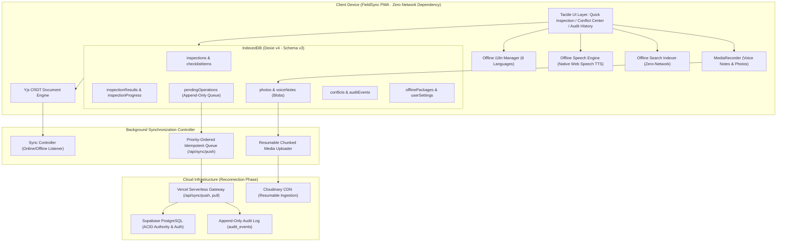

# FieldSync — Offline-First Collaborative Field Inspection PWA

[](https://www.typescriptlang.org/)
[](https://vitejs.dev/)
[](https://react.dev/)
[](https://dexie.org/)
[](https://yjs.dev/)
[](https://supabase.com/)
[-green.svg)](https://vitest.dev/)

> **FieldSync** is a production-grade, offline-first Progressive Web Application (PWA) built to solve multi-user field inspection in environments with zero connectivity.

---

## 🎯 Problem Statement (WA-1)

**WA-1. Offline-first collaborative field inspection app**
- **Problem**: Technicians fill shared checklists, notes, and photos in places with no connectivity.
- **Build**: A PWA or mobile app that works fully offline, syncs multi-user edits using CRDTs (or operational transforms), and shows a readable conflict and audit history instead of silently overwriting data.
- **Why it’s hard**: The sync protocol, schema migrations on clients that have been offline for days, and resumable media uploads.

---

## 💡 How FieldSync Solves the Hard Challenges

### 1. The Sync Protocol (`/api/sync/push` & `/api/sync/pull`)
- **Idempotency Guard**: Every operational mutation generates a unique `operationId`. Upon reconnecting, the server checks `supabaseAdmin.from('operations').select('operation_id').eq('operation_id', op.operationId)`. Duplicates from network retries are acknowledged safely without repeated side-effects.
- **CRDT State Convergence**: Inspection checklists are modeled as Yjs documents (`Y.Doc` with `Y.Map`). Local edits generate compact binary state delta vectors (`Y.encodeStateAsUpdate`). The server applies deltas (`Y.applyUpdate`), allowing multi-user concurrent edits to converge deterministically without central lock contention.
- **Causal Ordering**: Monotonic Lamport logical clocks detect causality violations and race conditions across distributed devices.

### 2. Schema Migrations on Clients Offline for Days
- **Strict Non-Destructive Migrations**: Implemented in [`src/lib/db/schema.ts`](file:///c:/Users/tharu/Downloads/erodde/src/lib/db/schema.ts) via Dexie.js v4.
- **Sequential Migration Chain**:
  - `Version 1`: Core tables (`users`, `devices`, `inspections`, `assets`, `checklistItems`, `inspectionResults`, `notes`, `media`, `operations`, `conflicts`, `auditEvents`, `syncState`, `appMetadata`).
  - `Version 2`: Schema evolution adding `priority`, `scheduledDate`, checklist item units, operation retry counters, and `localBlob` support in `media`. Upgrades execute an asynchronous transaction backfilling data (`priority = 'MEDIUM'`) and recording migration history in `appMetadata`.
  - `Version 3`: Adds `voiceNotes` (audio blobs), `inspectionProgress` (state bookmarking), `offlinePackages`, `userSettings`, and compound index `[inspectionId+checklistItemId]` on `inspectionResults`.
- **Durability Guarantee**: Client devices that remain offline for days or weeks across releases automatically run sequential migrations upon launch ($v_1 \rightarrow v_2 \rightarrow v_3$) without wiping uncommitted offline data or binary Blobs.

### 3. Resumable Media Uploads
- **Chunked Byte-Range Pipeline**: Implemented in [`src/lib/media/resumableUpload.ts`](file:///c:/Users/tharu/Downloads/erodde/src/lib/media/resumableUpload.ts). Large photographic media ($2\text{--}8$\,MB) is partitioned into 1\,MB chunks uploaded to Cloudinary via server-signed authorizations ([`api/media/sign.ts`](file:///c:/Users/tharu/Downloads/erodde/api/media/sign.ts)).
- **IndexedDB Offset Tracking**: The confirmed byte offset is persisted in the local `media` store after each chunk. If network connectivity drops mid-upload, the process resumes from the last confirmed byte rather than restarting from zero.
- **Two-Tier Priority Queue**: Low-bandwidth, high-priority payloads (voice notes and CRDT delta vectors $< 150$\,KB) are dispatched before heavy photos, ensuring immediate central management visibility.
- **Ghost-Upload Prevention**: Deleting an unsynced photo locally excises its pending queue operation, preventing wasted bandwidth.

### 4. Readable Conflict Resolution & Immutable Audit History
- **Conflict Center ([`src/pages/ConflictCenter.tsx`](file:///c:/Users/tharu/Downloads/erodde/src/pages/ConflictCenter.tsx))**: Detects concurrent field collisions and displays a clear side-by-side visual diff (*Local Value* vs. *Server Value*, conflicting technician, timestamp). Users explicitly select `KEEP_MINE`, `KEEP_THEIR`, or synthesize a merged entry via [`/api/conflicts/resolve.ts`](file:///c:/Users/tharu/Downloads/erodde/api/conflicts/resolve.ts) instead of suffering silent overwrites.
- **Audit History ([`src/pages/AuditHistory.tsx`](file:///c:/Users/tharu/Downloads/erodde/src/pages/AuditHistory.tsx))**: An immutable, append-only chronological audit log of all operations, mutations, and conflict resolution actions.

---

## 🏛️ System Architecture



---

## ⚡ Multimodal Offline Productivity Features

1. **Tactile Quick Inspection Mode**: High-contrast, large touch-target interface ($\ge 48 \times 48$\,dp) with binary/ternary decision pills (`[ GOOD ] [ DAMAGED ] [ N/A ]` and `[ PASS ] [ FAIL ]`), numeric stepper controls with physical units ($^\circ$C, bar, PSI), and single-action `[ SAVE & NEXT → ]` progression.
2. **Inspection Progress Persistence**: Dedicated `inspectionProgress` table tracks completion count, percentage, and exact checklist bookmarking. Closing the app or browser mid-inspection preserves progress, providing an immediate **"Resume Inspection"** card on the dashboard.
3. **Offline Voice Notes**: Built-in audio recorder via HTML5 `MediaRecorder`. Audio observations are encoded as binary Blobs, saved locally in IndexedDB (`voiceNotes`), and equipped with a waveform playback preview.
4. **Offline Read Aloud (TTS)**: Built on the W3C `SpeechSynthesis` API to speak checklist instructions and safety alerts aloud for hands-free inspection.
5. **Zero-Network Multilingual Engine**: Complete localized dictionaries bundled client-side for **6 languages**:
   - English (`en`)
   - Tamil / தமிழ் (`ta`)
   - Hindi / हिन्दी (`hi`)
   - Telugu / తెలుగు (`te`)
   - Kannada / ಕನ್ನಡ (`kn`)
   - Malayalam / മലയാളம் (`ml`)
   *Technician notes and readings remain strictly verbatim without destructive auto-translation.*
6. **Instant Offline Search**: In-memory inverted token index over local `assets`, `inspections`, `checklistItems`, and `conflicts` delivering sub-millisecond query results without network latency.
7. **Storage Guardian & Safe Eviction**: Real-time disk quota inspection via `navigator.storage.estimate()`. Technicians can prune local caches, but the deletion algorithm strictly checks `syncStatus == 'synced'` to protect un-replicated evidence.

---

## 🗄️ Database Schema Reference (Dexie v4 / Schema v3)

```typescript
// Schema Definition (src/lib/db/schema.ts)
db.version(3).stores({
  users: 'id, email, role',
  devices: 'deviceId, userId',
  inspections: 'id, status, priority, assetId, *assignedTo, syncStatus, updatedAt',
  assets: 'id, assetCode, type',
  checklistItems: 'id, inspectionId, order',
  inspectionResults: 'id, [inspectionId+checklistItemId], inspectionId, checklistItemId, updatedBy, syncStatus',
  notes: 'id, inspectionId, authorId, syncStatus',
  media: 'id, inspectionId, checklistItemId, uploadStatus, syncStatus',
  operations: 'operationId, deviceId, userId, entityType, entityId, syncStatus, logicalClock, createdAt',
  conflicts: 'id, inspectionId, entityType, entityId, status, createdAt',
  auditEvents: 'id, operationId, userId, entityType, entityId, inspectionId, action, createdAt',
  syncState: 'deviceId',
  appMetadata: 'key',
  voiceNotes: 'id, inspectionId, checklistItemId, technicianId, uploadStatus, syncStatus, createdAt',
  inspectionProgress: 'inspectionId, lastOpenedAt',
  offlinePackages: 'id, downloadedAt, status',
  userSettings: 'key'
});
```

---

## 🚀 Getting Started

### Prerequisites
- **Node.js**: v18.0.0 or higher
- **npm**
- Modern browser with IndexedDB support (Chrome, Edge, Safari, Firefox)

### Installation & Local Setup
```bash
# Clone the repository
git clone https://github.com/Tharun4743/FieldSync.git
cd FieldSync


# Install dependencies
npm install

# Start local development server
npm run dev
```
Navigate to `http://localhost:5173` (or the local port shown in your terminal).

### Fast Role Logins (Development / Demonstration)
- **Tharun (Administrator)**: `tharun@gmail.com` / `123456`
- **Abi (Supervisor)**: `abi@gmail.com` / `123456`
- **Elakkiya (Field Technician)**: `elakkiya@gmail.com` / `123456`

### 🗄️ Supabase Database Configuration (Single SQL Schema)
FieldSync provides a single, consolidated SQL configuration script at [`supabase/schema.sql`](file:///c:/Users/tharu/Downloads/erodde/supabase/schema.sql):
- **100% Self-Contained**: Creates all tables (`users`, `devices`, `assets`, `inspections`, `checklist_items`, `inspection_results`, `notes`, `media`, `operations`, `conflicts`, `audit_events`, `yjs_updates`).
- **Automated Sync**: Triggers synchronize signups from `auth.users` to `public.users`.
- **Pre-Configured RLS**: Complete Row-Level Security policies for authenticated access.
- **Pre-Seeded Accounts**: Populates **Tharun** (Admin), **Abi** (Supervisor), and **Elakkiya** (Technician) directly into `auth.users` with encrypted passwords and assigned inspections.
- **Setup**: Open your Supabase Project $\rightarrow$ **SQL Editor** $\rightarrow$ Paste [`supabase/schema.sql`](file:///c:/Users/tharu/Downloads/erodde/supabase/schema.sql) $\rightarrow$ Run.

---

## 🧪 Automated Testing & Verification

FieldSync maintains 20 automated tests validating local persistence, offline productivity workflows, and synchronization:

```bash
# Run unit & integration test suites
npx vitest run

# Run linter
npm run lint

# Compile production bundle
npm run build
```

### Test Suites (`src/tests/`):
- **Local Database Suite (`localDatabase.test.ts`)**: 9 tests verifying schema migrations, composite indexing, and CRUD operations on binary Blobs.
- **Offline Productivity Suite (`offlineProductivity.test.ts`)**: 8 tests confirming priority queue sorting, multilingual dictionary lookups, and local search queries.
- **Sync & Migration Suite (`syncAndMigration.test.ts`)**: 3 tests validating schema upgrades, pending operations serialization, and idempotent replay.

---

## 📄 Project Documentation

- [**WORKFLOW.md**](file:///c:/Users/tharu/Downloads/erodde/WORKFLOW.md) — Operational sequence diagrams, state machines, and media queue processing.
- [**latex/main.pdf**](file:///c:/Users/tharu/Downloads/erodde/latex/main.pdf) — Ready-to-compile 3-page IEEE-format conference paper with native vector diagrams.
- [**latex/README.md**](file:///c:/Users/tharu/Downloads/erodde/latex/README.md) — LaTeX build instructions for terminal and Overleaf.
